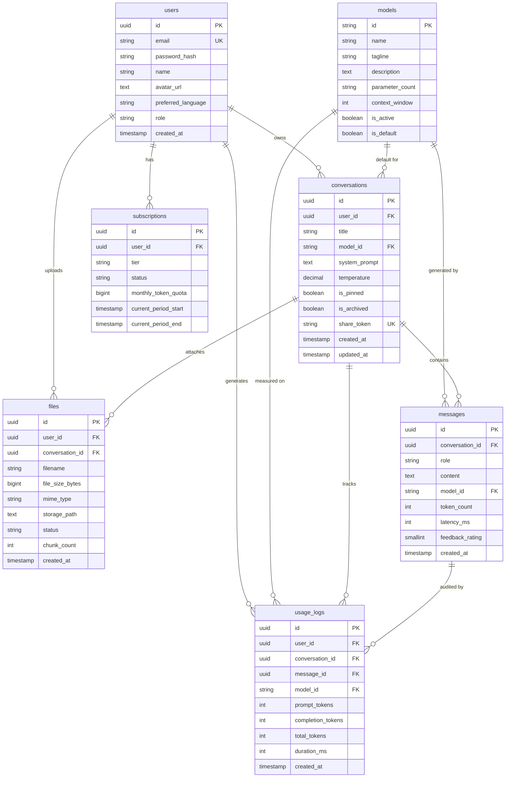

# AssameseGPT — Database Schema Specification

A production-ready relational database schema design for **AssameseGPT** targeting **PostgreSQL**, **Supabase**, and modern ORMs (**Prisma**, **Drizzle**). 

This schema establishes clean relational boundaries for conversations, token metrics, subscriptions, multimodal files, and model registries, ensuring that future backend integration (FastAPI, Node.js, or Go) is scalable and straightforward.

---

## 🏛 Entity Relationship (ER) Diagram



---

## 🗄 1. Table Specifications

### 1.1 `users`
Manages identity, credentials, language localization preferences, and access roles.

| Column | Type | Constraints | Description |
| :--- | :--- | :--- | :--- |
| `id` | `UUID` | `PRIMARY KEY, DEFAULT gen_random_uuid()` | Unique user identifier |
| `email` | `VARCHAR(255)` | `NOT NULL, UNIQUE` | User's primary email address |
| `password_hash` | `VARCHAR(255)` | `NULLABLE` | Bcrypt/Argon2 hash (null for OAuth) |
| `name` | `VARCHAR(100)` | `NOT NULL` | Display name (e.g. দেবাশীষ কাশ্যপ) |
| `avatar_url` | `TEXT` | `NULLABLE` | Link to hosted avatar image |
| `preferred_language` | `VARCHAR(10)` | `DEFAULT 'as'` | `'as'` (Assamese), `'en'`, or `'auto'` |
| `role` | `VARCHAR(20)` | `DEFAULT 'user'` | `'user'`, `'researcher'`, `'admin'` |
| `last_login_at` | `TIMESTAMPTZ` | `NULLABLE` | Timestamp of last session initiation |
| `created_at` | `TIMESTAMPTZ` | `DEFAULT NOW()` | Registration timestamp |
| `updated_at` | `TIMESTAMPTZ` | `DEFAULT NOW()` | Last update timestamp |

---

### 1.2 `models`
Maintains the registry of available custom Assamese language models and experimental checkpoints.

| Column | Type | Constraints | Description |
| :--- | :--- | :--- | :--- |
| `id` | `VARCHAR(50)` | `PRIMARY KEY` | Identifier (e.g., `'assamese-gpt-74m'`) |
| `name` | `VARCHAR(100)` | `NOT NULL` | Display title (e.g., `AssameseGPT 74M`) |
| `tagline` | `VARCHAR(255)` | `NULLABLE` | Short tagline (e.g., `Flagship Native Model`) |
| `description` | `TEXT` | `NULLABLE` | Full linguistic & parameter overview |
| `parameter_count` | `VARCHAR(50)` | `NOT NULL` | Label (e.g. `'74M Parameters'`) |
| `context_window` | `INTEGER` | `NOT NULL, DEFAULT 4096`| Maximum token limit |
| `is_active` | `BOOLEAN` | `DEFAULT TRUE` | Whether model is exposed to clients |
| `is_default` | `BOOLEAN` | `DEFAULT FALSE` | Default selection for new chats |
| `inference_url` | `TEXT` | `NULLABLE` | Internal vLLM/TGI server endpoint |
| `created_at` | `TIMESTAMPTZ` | `DEFAULT NOW()` | Release date |

---

### 1.3 `conversations`
Represents an individual chat thread containing a sequence of messages.

| Column | Type | Constraints | Description |
| :--- | :--- | :--- | :--- |
| `id` | `UUID` | `PRIMARY KEY, DEFAULT gen_random_uuid()` | Thread ID |
| `user_id` | `UUID` | `REFERENCES users(id) ON DELETE CASCADE, NULLABLE` | Owner ID (null for guest chats) |
| `title` | `VARCHAR(255)` | `NOT NULL` | Conversation title (in Assamese/English) |
| `model_id` | `VARCHAR(50)` | `REFERENCES models(id)` | Current active model for thread |
| `system_prompt` | `TEXT` | `NULLABLE` | Thread-specific override instructions |
| `temperature` | `NUMERIC(3, 2)`| `DEFAULT 0.70` | Sampling temperature (`0.00` - `1.00`) |
| `is_pinned` | `BOOLEAN` | `DEFAULT FALSE` | Stick to top of sidebar |
| `is_archived` | `BOOLEAN` | `DEFAULT FALSE` | Hidden from standard list |
| `share_token` | `VARCHAR(64)` | `UNIQUE, NULLABLE` | Secret slug for public read-only link |
| `created_at` | `TIMESTAMPTZ` | `DEFAULT NOW()` | Initial message timestamp |
| `updated_at` | `TIMESTAMPTZ` | `DEFAULT NOW()` | Last message timestamp |

---

### 1.4 `messages`
Stores individual prompts and model completions.

| Column | Type | Constraints | Description |
| :--- | :--- | :--- | :--- |
| `id` | `UUID` | `PRIMARY KEY, DEFAULT gen_random_uuid()` | Message ID |
| `conversation_id` | `UUID` | `NOT NULL, REFERENCES conversations(id) ON DELETE CASCADE` | Parent conversation |
| `role` | `VARCHAR(20)` | `NOT NULL` | `'user'`, `'assistant'`, `'system'`, `'error'` |
| `content` | `TEXT` | `NOT NULL` | Full raw Markdown text |
| `model_id` | `VARCHAR(50)` | `REFERENCES models(id), NULLABLE` | Model that generated the response |
| `token_count` | `INTEGER` | `DEFAULT 0` | Approximate token count |
| `latency_ms` | `INTEGER` | `NULLABLE` | Time to complete generation |
| `feedback_rating` | `SMALLINT` | `NULLABLE` | `1` (thumbs up), `-1` (thumbs down) |
| `feedback_comment`| `TEXT` | `NULLABLE` | Qualitative user feedback on response |
| `created_at` | `TIMESTAMPTZ` | `DEFAULT NOW()` | Sent timestamp |

---

### 1.5 `subscriptions`
Tracks user access tiers, billing status, and monthly token quotas.

| Column | Type | Constraints | Description |
| :--- | :--- | :--- | :--- |
| `id` | `UUID` | `PRIMARY KEY, DEFAULT gen_random_uuid()` | Subscription ID |
| `user_id` | `UUID` | `NOT NULL, REFERENCES users(id) ON DELETE CASCADE` | Linked user |
| `tier` | `VARCHAR(50)` | `NOT NULL, DEFAULT 'free'` | `'free'`, `'researcher'`, `'enterprise'` |
| `status` | `VARCHAR(30)` | `NOT NULL, DEFAULT 'active'` | `'active'`, `'past_due'`, `'canceled'` |
| `monthly_token_quota` | `BIGINT` | `DEFAULT 500000` | Monthly usage allowance |
| `current_period_start`| `TIMESTAMPTZ` | `DEFAULT NOW()` | Billing cycle start |
| `current_period_end` | `TIMESTAMPTZ` | `NOT NULL` | Billing cycle renewal |
| `stripe_customer_id` | `VARCHAR(100)` | `NULLABLE` | Stripe customer reference |
| `stripe_subscription_id`| `VARCHAR(100)` | `NULLABLE` | Stripe subscription reference |
| `created_at` | `TIMESTAMPTZ` | `DEFAULT NOW()` | Enrollment timestamp |
| `updated_at` | `TIMESTAMPTZ` | `DEFAULT NOW()` | Last update timestamp |

---

### 1.6 `usage_logs`
High-volume audit table for rate-limiting, analytics, and infrastructure capacity monitoring.

| Column | Type | Constraints | Description |
| :--- | :--- | :--- | :--- |
| `id` | `UUID` | `PRIMARY KEY, DEFAULT gen_random_uuid()` | Log entry ID |
| `user_id` | `UUID` | `REFERENCES users(id) ON DELETE SET NULL, NULLABLE` | Associated user |
| `conversation_id` | `UUID` | `REFERENCES conversations(id) ON DELETE SET NULL, NULLABLE` | Target conversation |
| `message_id` | `UUID` | `REFERENCES messages(id) ON DELETE SET NULL, NULLABLE` | Specific message |
| `model_id` | `VARCHAR(50)` | `NOT NULL, REFERENCES models(id)` | Model invoked |
| `prompt_tokens` | `INTEGER` | `NOT NULL, DEFAULT 0` | Input token count |
| `completion_tokens` | `INTEGER` | `NOT NULL, DEFAULT 0` | Generated token count |
| `total_tokens` | `INTEGER` | `NOT NULL, DEFAULT 0` | Combined token cost |
| `duration_ms` | `INTEGER` | `NOT NULL` | Execution time |
| `status_code` | `INTEGER` | `NOT NULL, DEFAULT 200` | HTTP response status |
| `ip_address` | `VARCHAR(45)` | `NULLABLE` | IPv4 / IPv6 client address |
| `created_at` | `TIMESTAMPTZ` | `DEFAULT NOW()` | Request timestamp |

---

### 1.7 `files`
Catalogues documents uploaded for RAG (Retrieval-Augmented Generation) and knowledge search (Phase 3).

| Column | Type | Constraints | Description |
| :--- | :--- | :--- | :--- |
| `id` | `UUID` | `PRIMARY KEY, DEFAULT gen_random_uuid()` | File ID |
| `user_id` | `UUID` | `NOT NULL, REFERENCES users(id) ON DELETE CASCADE` | File uploader |
| `conversation_id` | `UUID` | `REFERENCES conversations(id) ON DELETE SET NULL, NULLABLE` | Scoped conversation |
| `filename` | `VARCHAR(255)` | `NOT NULL` | Original filename (e.g. `buranji_chapter1.pdf`) |
| `file_size_bytes` | `BIGINT` | `NOT NULL` | Byte size |
| `mime_type` | `VARCHAR(100)` | `NOT NULL` | `'application/pdf'`, `'text/plain'`, etc. |
| `storage_path` | `TEXT` | `NOT NULL` | S3 / Supabase storage bucket path |
| `status` | `VARCHAR(30)` | `DEFAULT 'uploaded'` | `'uploaded'`, `'indexing'`, `'indexed'`, `'failed'` |
| `chunk_count` | `INTEGER` | `DEFAULT 0` | Vector chunks created |
| `embedding_model` | `VARCHAR(100)` | `NULLABLE` | Model used for vector embeddings |
| `created_at` | `TIMESTAMPTZ` | `DEFAULT NOW()` | Upload timestamp |
| `updated_at` | `TIMESTAMPTZ` | `DEFAULT NOW()` | Indexing completion timestamp |

---

## ⚡ 2. Recommended Database Indexes

Optimized for high read throughput on conversations and message threads:

```sql
-- Conversations lookups by user and recency
CREATE INDEX idx_conversations_user_updated ON conversations(user_id, updated_at DESC);
CREATE INDEX idx_conversations_share_token ON conversations(share_token) WHERE share_token IS NOT NULL;

-- Messages chronological ordering in chat window
CREATE INDEX idx_messages_conversation_created ON messages(conversation_id, created_at ASC);

-- Usage monitoring & billing aggregates
CREATE INDEX idx_usage_logs_user_created ON usage_logs(user_id, created_at DESC);
CREATE INDEX idx_usage_logs_model ON usage_logs(model_id);

-- Files lookup by conversation or user
CREATE INDEX idx_files_user_id ON files(user_id);
CREATE INDEX idx_files_conversation_id ON files(conversation_id);
```

---

## 📜 3. Complete PostgreSQL DDL Script

```sql
-- Enable UUID extension
CREATE EXTENSION IF NOT EXISTS "uuid-ossp";

-- 1. Users Table
CREATE TABLE users (
    id UUID PRIMARY KEY DEFAULT uuid_generate_v4(),
    email VARCHAR(255) NOT NULL UNIQUE,
    password_hash VARCHAR(255),
    name VARCHAR(100) NOT NULL,
    avatar_url TEXT,
    preferred_language VARCHAR(10) DEFAULT 'as',
    role VARCHAR(20) DEFAULT 'user',
    last_login_at TIMESTAMPTZ,
    created_at TIMESTAMPTZ DEFAULT NOW(),
    updated_at TIMESTAMPTZ DEFAULT NOW()
);

-- 2. Models Table
CREATE TABLE models (
    id VARCHAR(50) PRIMARY KEY,
    name VARCHAR(100) NOT NULL,
    tagline VARCHAR(255),
    description TEXT,
    parameter_count VARCHAR(50) NOT NULL,
    context_window INTEGER NOT NULL DEFAULT 4096,
    is_active BOOLEAN DEFAULT TRUE,
    is_default BOOLEAN DEFAULT FALSE,
    inference_url TEXT,
    created_at TIMESTAMPTZ DEFAULT NOW()
);

-- 3. Conversations Table
CREATE TABLE conversations (
    id UUID PRIMARY KEY DEFAULT uuid_generate_v4(),
    user_id UUID REFERENCES users(id) ON DELETE CASCADE,
    title VARCHAR(255) NOT NULL,
    model_id VARCHAR(50) REFERENCES models(id),
    system_prompt TEXT,
    temperature NUMERIC(3, 2) DEFAULT 0.70,
    is_pinned BOOLEAN DEFAULT FALSE,
    is_archived BOOLEAN DEFAULT FALSE,
    share_token VARCHAR(64) UNIQUE,
    created_at TIMESTAMPTZ DEFAULT NOW(),
    updated_at TIMESTAMPTZ DEFAULT NOW()
);

-- 4. Messages Table
CREATE TABLE messages (
    id UUID PRIMARY KEY DEFAULT uuid_generate_v4(),
    conversation_id UUID NOT NULL REFERENCES conversations(id) ON DELETE CASCADE,
    role VARCHAR(20) NOT NULL CHECK (role IN ('user', 'assistant', 'system', 'error')),
    content TEXT NOT NULL,
    model_id VARCHAR(50) REFERENCES models(id),
    token_count INTEGER DEFAULT 0,
    latency_ms INTEGER,
    feedback_rating SMALLINT CHECK (feedback_rating IN (-1, 1)),
    feedback_comment TEXT,
    created_at TIMESTAMPTZ DEFAULT NOW()
);

-- 5. Subscriptions Table
CREATE TABLE subscriptions (
    id UUID PRIMARY KEY DEFAULT uuid_generate_v4(),
    user_id UUID NOT NULL REFERENCES users(id) ON DELETE CASCADE,
    tier VARCHAR(50) NOT NULL DEFAULT 'free',
    status VARCHAR(30) NOT NULL DEFAULT 'active',
    monthly_token_quota BIGINT DEFAULT 500000,
    current_period_start TIMESTAMPTZ DEFAULT NOW(),
    current_period_end TIMESTAMPTZ NOT NULL,
    stripe_customer_id VARCHAR(100),
    stripe_subscription_id VARCHAR(100),
    created_at TIMESTAMPTZ DEFAULT NOW(),
    updated_at TIMESTAMPTZ DEFAULT NOW()
);

-- 6. Usage Logs Table
CREATE TABLE usage_logs (
    id UUID PRIMARY KEY DEFAULT uuid_generate_v4(),
    user_id UUID REFERENCES users(id) ON DELETE SET NULL,
    conversation_id UUID REFERENCES conversations(id) ON DELETE SET NULL,
    message_id UUID REFERENCES messages(id) ON DELETE SET NULL,
    model_id VARCHAR(50) NOT NULL REFERENCES models(id),
    prompt_tokens INTEGER NOT NULL DEFAULT 0,
    completion_tokens INTEGER NOT NULL DEFAULT 0,
    total_tokens INTEGER NOT NULL DEFAULT 0,
    duration_ms INTEGER NOT NULL,
    status_code INTEGER NOT NULL DEFAULT 200,
    ip_address VARCHAR(45),
    created_at TIMESTAMPTZ DEFAULT NOW()
);

-- 7. Files Table (RAG & Knowledge Base)
CREATE TABLE files (
    id UUID PRIMARY KEY DEFAULT uuid_generate_v4(),
    user_id UUID NOT NULL REFERENCES users(id) ON DELETE CASCADE,
    conversation_id UUID REFERENCES conversations(id) ON DELETE SET NULL,
    filename VARCHAR(255) NOT NULL,
    file_size_bytes BIGINT NOT NULL,
    mime_type VARCHAR(100) NOT NULL,
    storage_path TEXT NOT NULL,
    status VARCHAR(30) DEFAULT 'uploaded',
    chunk_count INTEGER DEFAULT 0,
    embedding_model VARCHAR(100),
    created_at TIMESTAMPTZ DEFAULT NOW(),
    updated_at TIMESTAMPTZ DEFAULT NOW()
);

-- Initial Model Seeds matching AssameseGPT specification
INSERT INTO models (id, name, tagline, description, parameter_count, context_window, is_default)
VALUES 
    ('assamese-gpt-74m', 'AssameseGPT 74M', 'Flagship Native Model', 'Deepest comprehension of Assamese grammar, nuances, literature, and general knowledge.', '74M Parameters', 4096, TRUE),
    ('assamese-gpt-17m', 'AssameseGPT 17M', 'Ultra Lightweight & Fast', 'Lightning-fast inference optimized for low-latency dialogue and device efficiency.', '17M Parameters', 2048, FALSE),
    ('assamese-gpt-enterprise', 'AssameseGPT Research v2', 'Multilingual & Code Experimental', 'Fine-tuned on high-quality Assamese, Bengali, and English multilingual parallel corpora.', '125M Parameters', 8192, FALSE);
```
