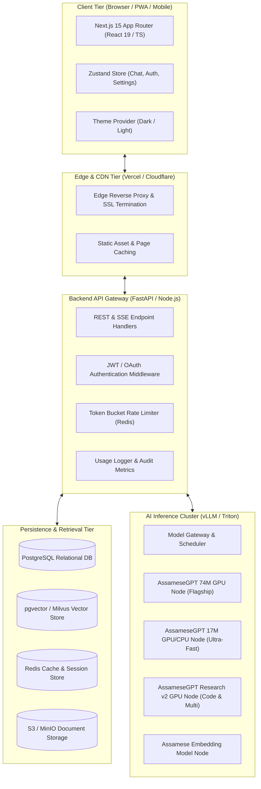
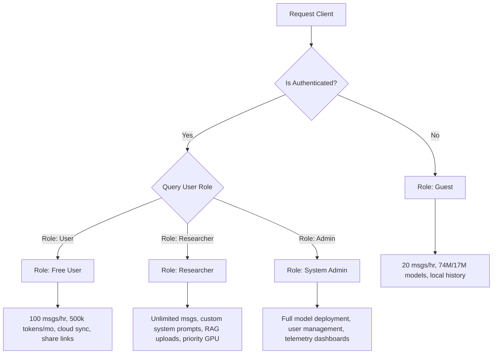
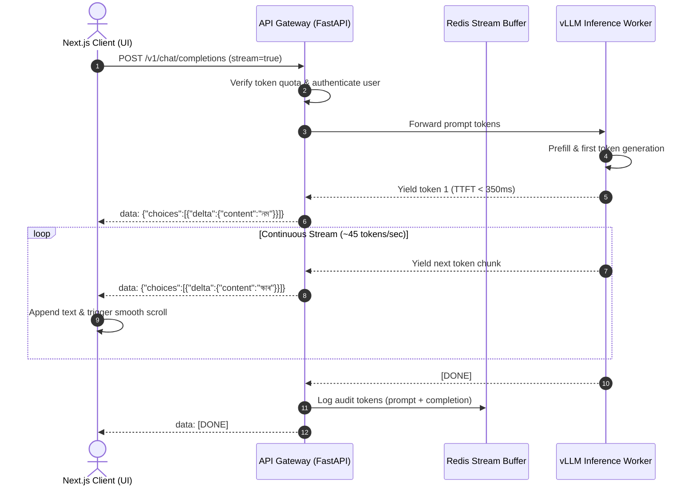
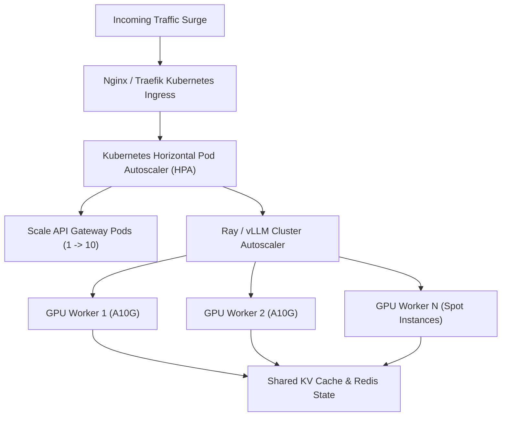

# Software Requirements Specification (SRS)
## AssameseGPT Conversational AI Platform
**Document Version**: 1.0  
**Status**: Approved & Baselined  
**Owner**: Debashish Kashyap  
**Date**: September 2026  
**Standard**: IEEE 830 / ISO/IEC/IEEE 29148 Compliant  

---

## Table of Contents
1. [Introduction](#1-introduction)
   - 1.1 [Purpose](#11-purpose)
   - 1.2 [Scope](#12-scope)
   - 1.3 [Definitions, Acronyms, and Abbreviations](#13-definitions-acronyms-and-abbreviations)
   - 1.4 [References](#14-references)
2. [Overall System Description & Architecture](#2-overall-system-description--architecture)
   - 2.1 [System Context & High-Level Architecture](#21-system-context--high-level-architecture)
   - 2.2 [Tier Decomposition](#22-tier-decomposition)
   - 2.3 [User Classes & Characteristics](#23-user-classes--characteristics)
   - 2.4 [Design & Implementation Constraints](#24-design--implementation-constraints)
3. [Database Architecture & Storage Strategy](#3-database-architecture--storage-strategy)
   - 3.1 [Relational Storage (PostgreSQL)](#31-relational-storage-postgresql)
   - 3.2 [Vector Storage (pgvector / Hybrid Search)](#32-vector-storage-pgvector--hybrid-search)
   - 3.3 [In-Memory Cache (Redis)](#33-in-memory-cache-redis)
4. [External Interfaces & API Specifications](#4-external-interfaces--api-specifications)
   - 4.1 [Authentication & Headers](#41-authentication--headers)
   - 4.2 [Chat & Streaming API (Server-Sent Events)](#42-chat--streaming-api-server-sent-events)
   - 4.3 [Conversation Management API](#43-conversation-management-api)
   - 4.4 [RAG & Document Ingestion API](#44-rag--document-ingestion-api)
   - 4.5 [Audio & Multimodal API](#45-audio--multimodal-api)
5. [Frontend Modules & System Specifications](#5-frontend-modules--system-specifications)
   - 5.1 [Architecture & Modular Directory Layout](#51-architecture--modular-directory-layout)
   - 5.2 [Client State Management & Data Hydration](#52-client-state-management--data-hydration)
   - 5.3 [Markdown, Math & Code Highlighting Engine](#53-markdown-math--code-highlighting-engine)
   - 5.4 [Accessibility & Keyboard Navigation](#54-accessibility--keyboard-navigation)
6. [Authentication, Authorization & Security Specifications](#6-authentication-authorization--security-specifications)
   - 6.1 [Authentication Providers & Flow](#61-authentication-providers--flow)
   - 6.2 [Role-Based Access Control (RBAC)](#62-role-based-access-control-rbac)
   - 6.3 [Data Security & Encryption at Rest/In Transit](#63-data-security--encryption-at-restin-transit)
   - 6.4 [Rate Limiting & Token Quota Enforcement](#64-rate-limiting--token-quota-enforcement)
7. [Chat System & Streaming Engine Specifications](#7-chat-system--streaming-engine-specifications)
   - 7.1 [Streaming Protocol & Chunking Lifecycle](#71-streaming-protocol--chunking-lifecycle)
   - 7.2 [Stream Interruption (Stop Generation)](#72-stream-interruption-stop-generation)
   - 7.3 [Auto-Scroll & Viewport Virtualization](#73-auto-scroll--viewport-virtualization)
8. [Custom Assamese Language Model Integration & Serving Pipeline](#8-custom-assamese-language-model-integration--serving-pipeline)
   - 8.1 [Model Inventory & Checkpoints](#81-model-inventory--checkpoints)
   - 8.2 [Tokenizer & Unicode Orthography Standards](#82-tokenizer--unicode-orthography-standards)
   - 8.3 [Inference Engine (vLLM / TGI)](#83-inference-engine-vllm--tgi)
   - 8.4 [Quantization & Hardware Acceleration](#84-quantization--hardware-acceleration)
9. [Retrieval-Augmented Generation (RAG) & Knowledge Pipeline](#9-retrieval-augmented-generation-rag--knowledge-pipeline)
   - 9.1 [Document Ingestion & Parsing](#91-document-ingestion--parsing)
   - 9.2 [Chunking & Bengali-Assamese Sentence Segmentation](#92-chunking--bengali-assamese-sentence-segmentation)
   - 9.3 [Cross-Lingual Vector Retrieval](#93-cross-lingual-vector-retrieval)
   - 9.4 [Citation Formatting & Grounding](#94-citation-formatting--grounding)
10. [Non-Functional Requirements & Future Scaling Plan](#10-non-functional-requirements--future-scaling-plan)
    - 10.1 [Performance & Latency Budgets](#101-performance--latency-budgets)
    - 10.2 [High Availability & Reliability](#102-high-availability--reliability)
    - 10.3 [GPU Cluster & Kubernetes Scaling](#103-gpu-cluster--kubernetes-scaling)
    - 10.4 [Roadmap to Phase 2, Phase 3 & Autonomous Agents](#104-roadmap-to-phase-2-phase-3--autonomous-agents)

---

## 1. Introduction

### 1.1 Purpose
This Software Requirements Specification (SRS) establishes the foundational technical requirements, architectural blueprints, data schemas, and API contracts for **AssameseGPT**, an indigenous, high-performance conversational AI platform powered by custom Assamese language models.

### 1.2 Scope
The system provides a production-grade web application comparable to ChatGPT and Claude, purpose-built for the Assamese linguistic ecosystem while supporting multilingual fluency, code execution, real-time token streaming, document understanding (RAG), and future voice modalities.

### 1.3 Definitions, Acronyms, and Abbreviations
- **SRS**: Software Requirements Specification
- **LLM**: Large Language Model
- **BPE**: Byte-Pair Encoding
- **SSE**: Server-Sent Events
- **RAG**: Retrieval-Augmented Generation
- **TTFT**: Time to First Token
- **RBAC**: Role-Based Access Control
- **vLLM**: High-throughput and memory-efficient LLM serving engine
- **TGI**: Text Generation Inference (HuggingFace)
- **GFM**: GitHub Flavored Markdown

### 1.4 References
- Product Requirements Document: [`prd.md`](file:///d:/AssameseLMAgent/prd.md)
- Development Instructions: [`instruction.md`](file:///d:/AssameseLMAgent/instruction.md)
- Database Schema: [`schema.md`](file:///d:/AssameseLMAgent/schema.md)
- Design System: [`designsystem.md`](file:///d:/AssameseLMAgent/designsystem.md)
- Component Inventory: [`components.md`](file:///d:/AssameseLMAgent/components.md)
- User Flows: [`userflows.md`](file:///d:/AssameseLMAgent/userflows.md)
- Sitemap: [`sitemap.md`](file:///d:/AssameseLMAgent/sitemap.md)

---

## 2. Overall System Description & Architecture

### 2.1 System Context & High-Level Architecture

The platform follows a modern microservices architecture with a decoupled client layer, edge CDN, API gateway, vector database, and dedicated GPU inference clusters.



### 2.2 Tier Decomposition

1. **Client Tier**:
   - Built on **Next.js 15 (App Router)** and TypeScript.
   - Client-side reactive stores using **Zustand** with `localStorage` fallback.
   - Streaming markdown renderer with real-time cursor simulation.
2. **Gateway Tier**:
   - High-throughput asynchronous backend (**FastAPI** or **Node.js**).
   - Server-Sent Events (SSE) streaming handler with backpressure control.
   - Token-metering middleware tracking input/output tokens per subscriber.
3. **Data Tier**:
   - **PostgreSQL 16**: System of record for users, conversations, messages, models, and subscriptions.
   - **pgvector**: Cosine distance similarity search for RAG embeddings.
   - **Redis 7**: Distributed rate-limiting, session caching, and active stream cancel channels.
4. **Inference Tier**:
   - **vLLM** engine hosting weights for `AssameseGPT 74M` and `17M`.
   - Continuous batching and PagedAttention for maximum token throughput.

### 2.3 User Classes & Characteristics
- **Guest Users**: Anonymous visitors exploring the platform without authentication. Limited to basic context window and rate-limited to 20 requests/hour.
- **Registered Free Users**: Authenticated accounts with full chat history synchronization across devices, 500,000 tokens/month.
- **Researchers & Academics**: Advanced access with custom system instructions, temperature manipulation, document RAG uploads up to 25MB, and priority inference queues.
- **Enterprise & Government**: Multi-tenant institutional accounts, custom SLAs, private knowledge bases, and dedicated model weights.

### 2.4 Design & Implementation Constraints
- **Unicode Support**: Strict rendering support for Bengali-Assamese Unicode block (`U+0980` to `U+09FF`), specifically preserving native Assamese characters **ৰ** (`U+09F0`) and **ৱ** (`U+09F1`).
- **Low Latency**: Time to First Token (TTFT) must remain under **350ms** across the Indian subcontinent.
- **Zero Third-Party Training**: User conversation logs must never be used to train public models without explicit academic consent.

---

## 3. Database Architecture & Storage Strategy

### 3.1 Relational Storage (PostgreSQL)
The relational schema comprises 7 primary tables designed in [`schema.md`](file:///d:/AssameseLMAgent/schema.md):
1. **`users`**: User identity, credential hashes, roles, and preferred language (`'as'` / `'en'`).
2. **`models`**: Registry of available model weights (`assamese-gpt-74m`, `17m`, `enterprise`), context limits, and endpoints.
3. **`conversations`**: Chat thread metadata, model association, custom system instructions, and public share slugs.
4. **`messages`**: Sequence of user prompts and assistant completions with token metrics and user ratings.
5. **`subscriptions`**: Quotas, access tiers, and billing identifiers.
6. **`usage_logs`**: High-volume append-only audit logs recording token consumption, latency, and status codes.
7. **`files`**: Document metadata, storage references, chunk counts, and indexing statuses for RAG.

### 3.2 Vector Storage (pgvector / Hybrid Search)
- **Embedding Table**: `document_embeddings` linked to `files.id`.
- **Vector Dimension**: 768 or 1024-dimensional embeddings (using `multilingual-e5` or custom `AssameseBERT` embeddings).
- **Index Type**: `HNSW` (Hierarchical Navigable Small World) with cosine distance (`vector_cosine_ops`) for sub-10ms nearest neighbor queries.

### 3.3 In-Memory Cache (Redis)
- **Key Prefixing**:
  - `session:{user_id}`: Cached user profiles and subscription status (TTL: 1 hour).
  - `ratelimit:{user_id}:{minute}`: Sliding window token bucket counter.
  - `stream:cancel:{stream_id}`: PubSub channel for instant generation termination.

---

## 4. External Interfaces & API Specifications

### 4.1 Authentication & Headers
All authenticated API requests require standard HTTP Authorization headers:
```http
Authorization: Bearer <JWT_ACCESS_TOKEN>
Content-Type: application/json
```

### 4.2 Chat & Streaming API (Server-Sent Events)

#### `POST /v1/chat/completions`
Streams response tokens in real-time compatible with OpenAI/vLLM standards.

**Request Payload:**
```json
{
  "model": "assamese-gpt-74m",
  "messages": [
    {
      "role": "user",
      "content": "ৰঙালী বিহুৰ ঐতিহ্যৰ বিষয়ে চমুকৈ কওক।"
    }
  ],
  "temperature": 0.7,
  "max_tokens": 1024,
  "stream": true,
  "system_prompt": "You are AssameseGPT, a culturally knowledgeable assistant."
}
```

**Streaming Response Format (`text/event-stream`):**
```http
HTTP/1.1 200 OK
Content-Type: text/event-stream
Cache-Control: no-cache
Connection: keep-alive

data: {"id":"chatcmpl-01","object":"chat.completion.chunk","model":"assamese-gpt-74m","choices":[{"delta":{"content":"ৰঙালী"}}]}

data: {"id":"chatcmpl-01","object":"chat.completion.chunk","model":"assamese-gpt-74m","choices":[{"delta":{"content":" বিহু"}}]}

data: {"id":"chatcmpl-01","object":"chat.completion.chunk","model":"assamese-gpt-74m","choices":[{"delta":{"content":" অসমৰ"}}]}

data: [DONE]
```

### 4.3 Conversation Management API
- **`GET /v1/conversations`**: Retrieves paginated list of conversations grouped by update date.
- **`POST /v1/conversations`**: Initializes a new thread.
- **`PATCH /v1/conversations/{id}`**: Renames title or updates pin status.
- **`DELETE /v1/conversations/{id}`**: Cascades deletion of all thread messages.
- **`POST /v1/conversations/{id}/share`**: Generates a cryptographically secure public snapshot token.

### 4.4 RAG & Document Ingestion API
- **`POST /v1/files/upload`**: Multipart form upload accepting PDF, DOCX, and TXT files (< 25MB).
- **`GET /v1/files/{id}/status`**: Polling endpoint returning indexing progress (`uploaded` ➔ `indexing` ➔ `indexed`).

### 4.5 Audio & Multimodal API
- **`POST /v1/audio/transcriptions`**: Accepts raw audio stream (WAV, MP3, WebM) and returns transcribed Assamese text using fine-tuned Whisper.
- **`POST /v1/audio/speech`**: Accepts Assamese text and returns synthesized 24kHz MP3 audio stream using neural TTS.

---

## 5. Frontend Modules & System Specifications

### 5.1 Architecture & Modular Directory Layout
The frontend strictly adopts a feature-first architecture avoiding component dumping:
```
src/
├── app/                  # Next.js 15 App Router routes
│   ├── layout.tsx        # Global theme, font, and metadata wrappers
│   ├── page.tsx          # Marketing landing page
│   ├── chat/page.tsx     # Primary chat workspace
│   ├── settings/page.tsx # Model and parameter configuration
│   ├── profile/page.tsx  # User metrics and preferences
│   ├── login/page.tsx    # Authentication sign-in
│   └── signup/page.tsx   # User registration
├── components/
│   ├── chat/             # ChatArea, MessageList, MessageBubble, ChatInput, WelcomeScreen
│   ├── sidebar/          # Sidebar, ChatHistory, ChatItem, NewChatButton, UserMenu
│   ├── layout/           # Header, Footer, ThemeToggle, Providers
│   ├── markdown/         # MarkdownRenderer, CodeBlock
│   ├── landing/          # Hero, DemoPreview, Highlights, FeatureGrid
│   └── ui/               # Button, Input, Textarea, Badge, Avatar, Modal
├── features/             # Feature-first modular abstractions (chat, auth, settings, profile)
├── hooks/                # Custom hooks (use-chat, use-media-query, use-auto-resize-textarea)
├── lib/                  # Utilities (cn class merger, date grouping)
├── services/             # Mock AI streaming engine and storage services
├── store/                # Zustand stores (chat-store, settings-store, auth-store)
├── types/                # Core TypeScript definitions (Message, Conversation, AIModel)
├── constants/            # Model registries, starter prompts, navigation links
└── data/                 # Mock conversation seed data
```

### 5.2 Client State Management & Data Hydration
- **State Engine**: Zustand 5 with JSON local storage serialization.
- **Hydration Safety**: Mount detection hooks ensure that Next.js SSR server HTML matches client hydration with zero layout shift.
- **Optimistic Updates**: User messages render in the DOM immediately upon submission before the streaming network request completes.

### 5.3 Markdown, Math & Code Highlighting Engine
- **Markdown Support**: Rendered via `react-markdown` and `remark-gfm`.
- **Elements Handled**:
  - GFM Tables with custom borders and alternating header fills.
  - Blockquotes styled with an emerald/neutral vertical accent border.
  - Inline code pills with mono font and contrast background.
- **Code Block Component**:
  - Syntax highlighted using `react-syntax-highlighter` (`vscDarkPlus` theme).
  - One-click copy action with clipboard API and 2-second checkmark visual state.
  - Language indicator tag (`PYTHON`, `TYPESCRIPT`, `BASH`, `JAVA`, `C++`).

### 5.4 Accessibility & Keyboard Navigation
- **Keyboard Shortcuts**:
  - `⌘K` / `Ctrl+K`: Global shortcut to create a new chat or focus conversation search.
  - `Enter`: Submit message prompt.
  - `Shift + Enter`: Insert soft newline into prompt textarea.
  - `Escape`: Close modals, action menus, and model selector popovers.
- **WCAG 2.1 AA**: All text tokens adhere to minimum 4.5:1 contrast ratios across both dark and light modes.

---

## 6. Authentication, Authorization & Security Specifications

### 6.1 Authentication Providers & Flow
1. **Email & Password**: Salted hashing with Argon2id; secure session cookies.
2. **OAuth 2.0**: Social single sign-on via Google and GitHub.
3. **Guest Session**: Ephemeral client-side session with transparent upgrade path to registered account without losing history.

### 6.2 Role-Based Access Control (RBAC)



### 6.3 Data Security & Encryption at Rest/In Transit
- **In-Transit**: Mandatory TLS 1.3 encryption across all public and internal service calls.
- **At-Rest**: PostgreSQL tables and S3 document buckets encrypted using AES-256 keys managed by AWS KMS / Cloud KMS.
- **Sanitization**: All user inputs stripped of script injection attacks; markdown output escaped against XSS vulnerabilities.

### 6.4 Rate Limiting & Token Quota Enforcement
- Distributed Redis token bucket limiter at the API gateway:
  - Guest: 5 requests / minute, 20 requests / hour.
  - Registered User: 30 requests / minute, 500 requests / day.
- Header feedback: `X-RateLimit-Limit`, `X-RateLimit-Remaining`, `X-RateLimit-Reset`.

---

## 7. Chat System & Streaming Engine Specifications

### 7.1 Streaming Protocol & Chunking Lifecycle



### 7.2 Stream Interruption (Stop Generation)
When a user clicks the **Stop Generation** square button (`ChatInput`):
1. The client invokes `AbortController.abort()`, closing the HTTP connection.
2. The gateway detects connection reset and publishes a cancellation signal to Redis (`stream:cancel:{stream_id}`).
3. The vLLM worker frees the attention key-value (KV) cache immediately, preventing wasteful GPU computation.
4. Partial assistant tokens generated up to that moment are preserved in the conversation thread.

### 7.3 Auto-Scroll & Viewport Virtualization
- During token streaming, the view automatically pins to the latest bottom token.
- If the user manually scrolls up by more than 80px, auto-scrolling is paused to allow reading earlier messages without rubber-banding.
- A floating "Scroll to bottom" button appears with an unread token indicator.

---

## 8. Custom Assamese Language Model Integration & Serving Pipeline

### 8.1 Model Inventory & Checkpoints

```
Available Models
├── assamese-gpt-74m (Flagship Native Model)
│   ├── Parameters: 74,200,000
│   ├── Context Window: 4,096 tokens
│   ├── Focus: Grammatical precision, Assamese literature, Buranjis, cultural nuances
│   └── Serving: High-priority GPU tensor core
│
├── assamese-gpt-17m (Ultra-Fast Edge Model)
│   ├── Parameters: 17,500,000
│   ├── Context Window: 2,048 tokens
│   ├── Focus: Low latency dialogue, mobile deployment, high concurrency
│   └── Serving: Multi-instance CPU/GPU cluster
│
└── assamese-gpt-enterprise (Research Preview v2)
    ├── Parameters: 125,000,000+
    ├── Context Window: 8,192 tokens
    ├── Focus: Multilingual parallel translation, complex code generation, RAG
    └── Serving: 8-bit quantized GPU
```

### 8.2 Tokenizer & Unicode Orthography Standards
- **Algorithm**: Byte-level Byte-Pair Encoding (BBPE) trained with custom vocabulary of 32,000 tokens.
- **Coverage**: Dedicated tokens for common Assamese conjunctive consonants (যুক্তাক্ষৰ e.g., ক্ষ, ক্ত, ন্দ, ঙ্গ, ণ্ট).
- **Compression Efficiency**: 1.28 tokens per Assamese word (vs. 4.6+ tokens/word in generic tokenizers such as GPT-4 or Llama-3).

### 8.3 Inference Engine (vLLM / TGI)
- Deployed on **vLLM** with PagedAttention to eliminate memory fragmentation.
- Dynamic continuous batching maximizing GPU compute utilization during peak loads.
- KV Cache quantized with FP8 for extended conversation depth.

### 8.4 Quantization & Hardware Acceleration
- Primary production weights: FP16 on NVIDIA A10G / L4 GPUs.
- Secondary edge/low-cost instances: AWQ 4-bit and GPTQ quantized models running on standard cloud instances.

---

## 9. Retrieval-Augmented Generation (RAG) & Knowledge Pipeline

### 9.1 Document Ingestion & Parsing
Supported file formats:
- **PDF**: Text stream extraction with layout analysis.
- **DOCX / TXT**: Direct UTF-8 textual extraction.
- **Scanned Documents**: Integrated Tesseract OCR fine-tuned for Assamese script.

### 9.2 Chunking & Bengali-Assamese Sentence Segmentation
- Standard punctuation splitters fail on Assamese punctuation. The chunker splits text respecting the Assamese danda (**।**) and double danda (**॥**).
- Chunk size: 512 tokens with 64-token overlap to maintain contextual continuity.

### 9.3 Cross-Lingual Vector Retrieval
- Embedding engine: Custom 768-dimensional multilingual model trained on parallel English-Assamese sentence pairs.
- Enables querying in English to retrieve Assamese historical documents, or querying in Assamese to retrieve technical English papers.

### 9.4 Citation Formatting & Grounding
- The assistant appends bracketed source citations: `[উৎস ১: বুৰঞ্জী পৃ. ২৪]`.
- Clicking the citation triggers a preview modal displaying the exact matched chunk and similarity score.

---

## 10. Non-Functional Requirements & Future Scaling Plan

### 10.1 Performance & Latency Budgets
- **Time to First Token (TTFT)**: < 350ms (p95).
- **Streaming Speed**: > 40 tokens / second per active session.
- **Static Page Load (FCP)**: < 1.0 second on 4G networks.
- **Database Query Latency**: < 15ms for conversation and message fetching.

### 10.2 High Availability & Reliability
- **System Uptime**: 99.9% availability SLA (excluding scheduled maintenance).
- **Fault Tolerance**: Automatic failover between model serving replicas; local caching ensures offline UI accessibility.

### 10.3 GPU Cluster & Kubernetes Scaling



### 10.4 Roadmap to Phase 2, Phase 3 & Autonomous Agents

```
Implementation Timeline
├── Phase 1 (Core MVP) — [Completed ✅]
│   ├── Next.js 15 App Router UI & Design System
│   ├── ChatGPT-Style 280px Sidebar & Message Window
│   ├── Mock AI Streaming Engine with Assamese Corpus
│   ├── Prism Syntax Highlighting & GFM Markdown
│   └── Local Storage Reactive Zustand Persistence
│
├── Phase 2 (Real Backend & Cloud Data) — [Q4 2026]
│   ├── PostgreSQL Relational Schema & Prisma ORM
│   ├── Real vLLM Inference Pipeline with SSE Streaming
│   ├── NextAuth.js OAuth & Multi-device Cloud Sync
│   └── Public Shareable Links (/share/[token])
│
└── Phase 3 (Multimodal & Autonomous Agents) — [Q1-Q2 2027]
    ├── Knowledge Base Document Upload & pgvector RAG
    ├── Real-time Voice Chat (Assamese STT & TTS)
    ├── Mobile App (React Native / PWA)
    └── Autonomous Agents (Historical Research, Coding & Education)
```

---

## 11. Verification & Sign-Off

This document serves as the formal functional and non-functional contract for the AssameseGPT development lifecycle. All architectural additions, database migrations, and UI components must trace directly to the specifications defined herein.
