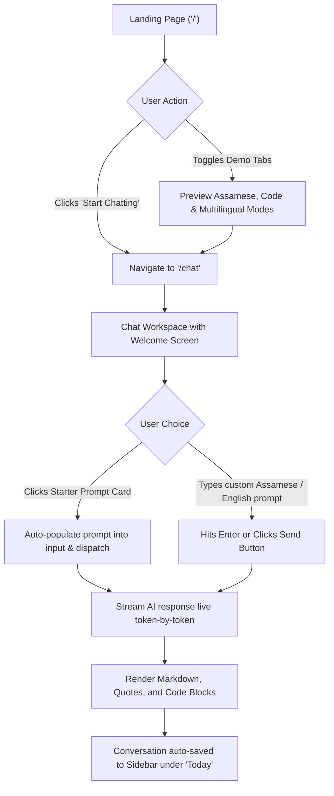
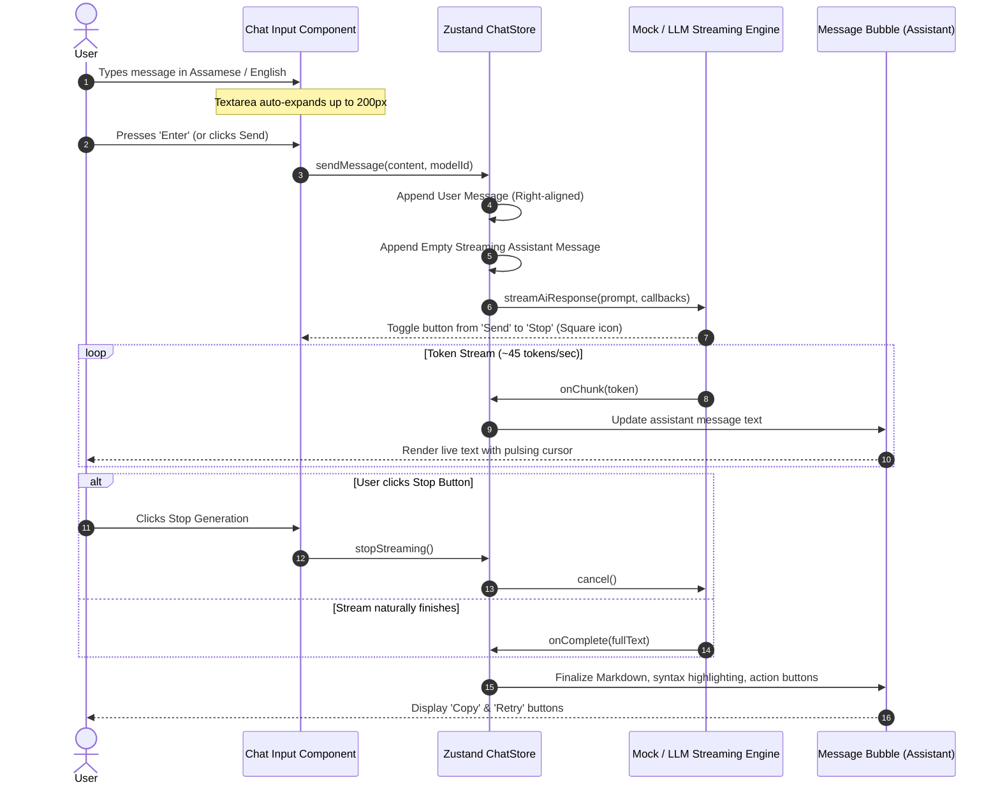
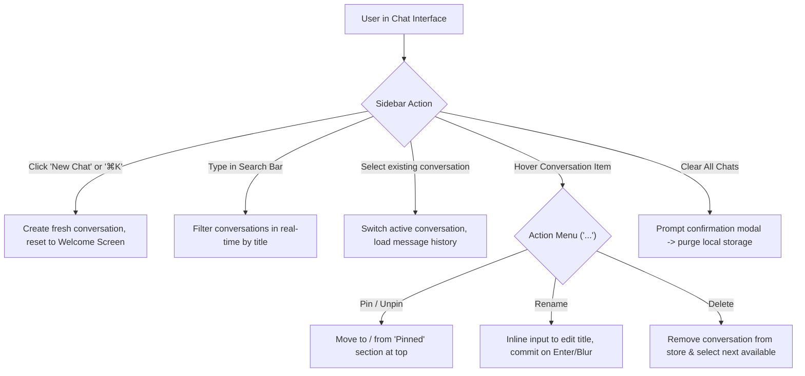
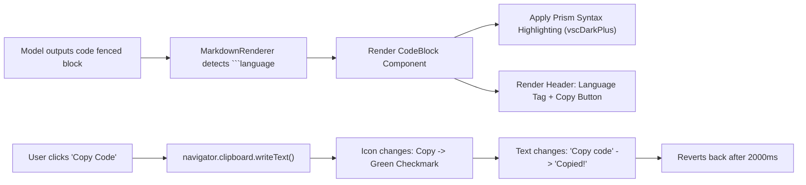
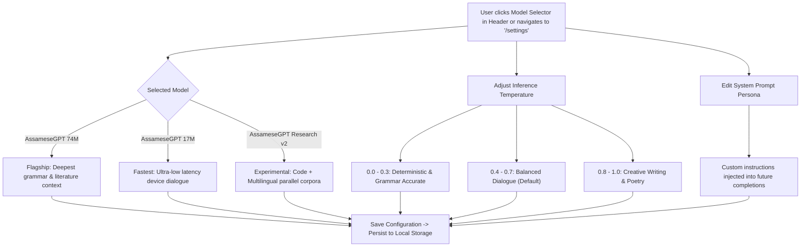
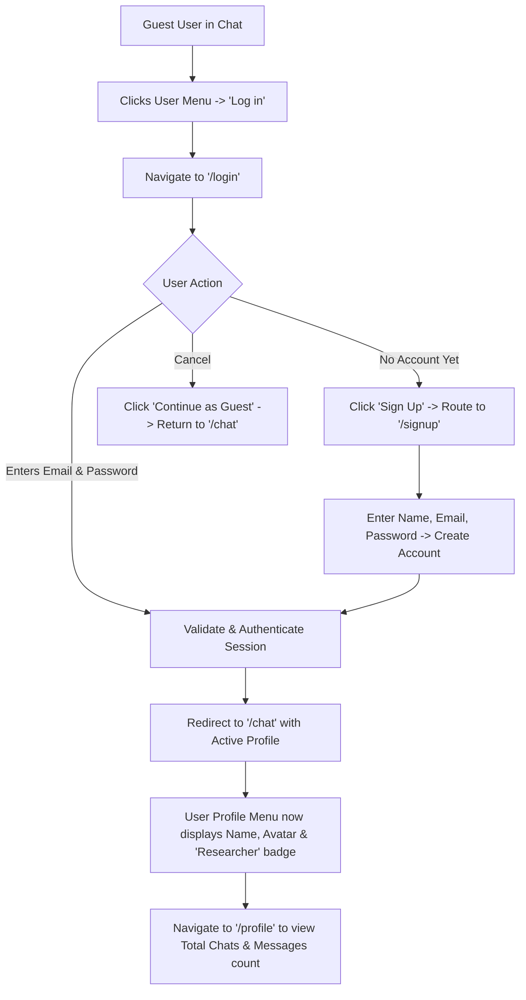
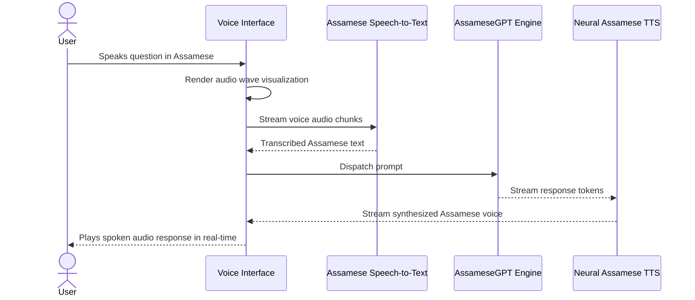
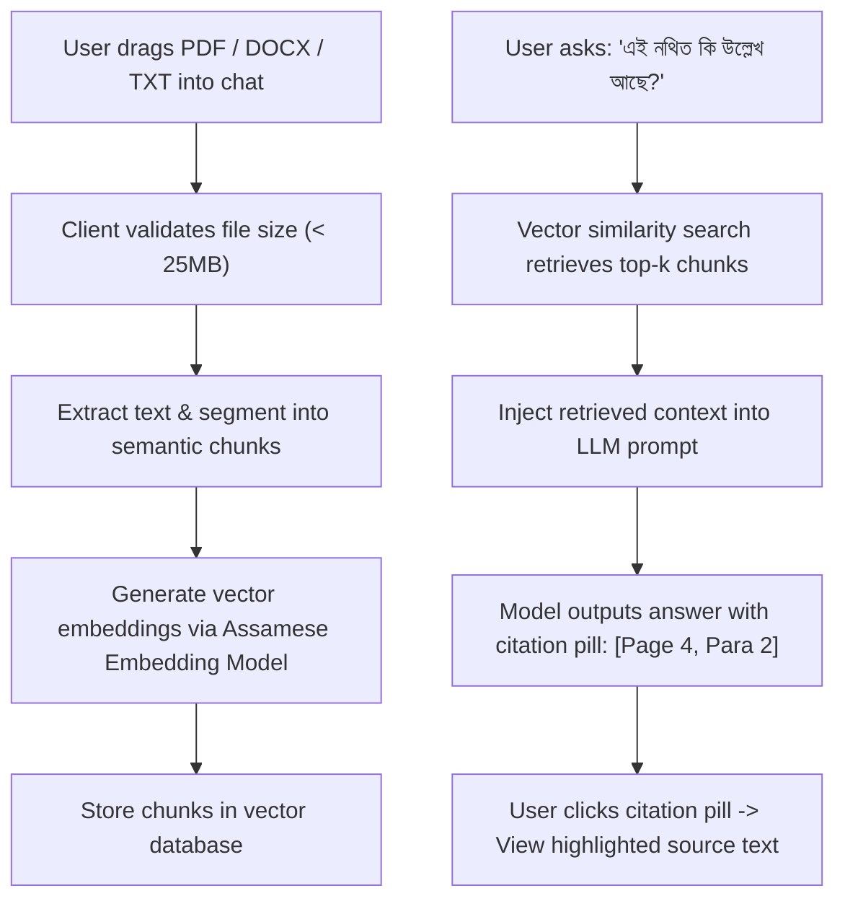
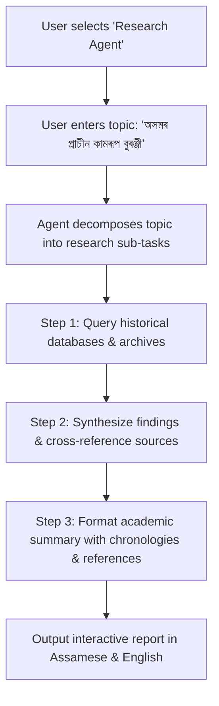
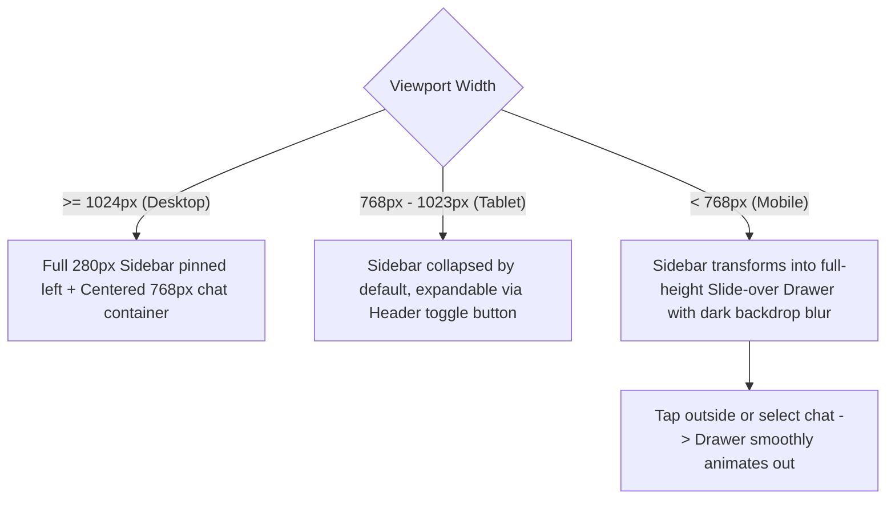

# AssameseGPT — Detailed User Flows

Comprehensive end-to-end user journeys, decision logic, and interaction diagrams for **AssameseGPT**, reflecting the platform specifications from [`prd.md`](file:///d:/AssameseLMAgent/prd.md), [`instruction.md`](file:///d:/AssameseLMAgent/instruction.md), and [`sitemap.md`](file:///d:/AssameseLMAgent/sitemap.md).

---

## 👥 User Personas

| Persona | Motivation & Background | Primary Needs |
| :--- | :--- | :--- |
| **Guest / First-Time Visitor** | Wants to quickly test Assamese comprehension without registration barriers. | Zero-friction entry, one-click starter prompts, fast response time. |
| **Native Speaker / Student** | Academic inquiries, Assamese literature analysis, homework assistance, grammar checks. | High-quality Assamese typography, accurate cultural context, clear explanations. |
| **Researcher / Linguist** | Studying North East languages, dialect nuances, translation fidelity. | Model parameter control (temperature, system prompt), model comparison (74M vs 17M). |
| **Developer / Engineer** | Technical scripting, translation integration, prompt engineering, API usage. | Accurate code blocks with syntax highlighting, copy buttons, future API keys. |

---

## 🌊 Flow 1: First-Time Discovery to Initial Chat (Guest Journey)

### Detailed Interaction Steps:
1. **Landing Entry**: Visitor arrives at `/` and is greeted with the headline *"Assamese AI. Built From Scratch."*
2. **Interactive Preview**: Visitor can test simulated outputs (Assamese Poetry, Python Tokenizer, Multilingual chat) without leaving the landing page.
3. **Transition to Chat**: Clicks **Start Chatting** or **Launch App** to route immediately to `/chat`. No forced sign-in modal blocks entry.
4. **Welcome Screen**:
   - Greets user in Assamese: *"নমস্কাৰ! মই আপোনাক কিদৰে সহায় কৰিব পাৰোঁ?"*
   - Displays 4 distinct starter prompts:
     - 🌸 *ৰঙালী বিহুৰ তাৎপৰ্য* (Culture)
     - 📖 *অসমীয়া ব্যাকৰণ আৰু প্ৰয়োগ* (Language)
     - 💻 *Python ৱেব স্ক্ৰেপাৰ* (Code)
     - 🌐 *ইংৰাজী-অসমীয়া অনুবাদ* (Bilingual Translation)
5. **Prompt Dispatch**: Clicking a prompt card automatically dispatches the message, displays the user message bubble right-aligned, and starts live streaming the assistant response.

---

## 💬 Flow 2: Chat Conversation & Real-Time Token Streaming

### Edge Cases & State Handlers:
- **Empty input**: Send button is disabled (`opacity: 50%`, cursor not-allowed).
- **Shift + Enter**: Inserts a new line without triggering form submission.
- **Mid-stream cancellation**: Clicking the stop square halts chunk emission immediately; all tokens generated up to that point are preserved.
- **Auto-scroll behavior**: The viewport sticks to bottom during streaming, but allows the user to scroll up freely without getting forced back down.

---

## 🗂 Flow 3: Conversation Management (Sidebar)

### Hierarchy & Date Grouping:
1. **Pinned**: Highest priority items, fixed at top with a pin icon.
2. **Today**: Conversations created or modified on the current day.
3. **Yesterday**: Conversations from the previous calendar day.
4. **Previous 7 Days**: Conversations between 2 and 7 days old.
5. **Previous 30 Days**: Older conversations grouped by month.

---

## 💻 Flow 4: Code Block Interaction & Copying

---

## ⚙️ Flow 5: Model Selection & Parameter Customization

---

## 👤 Flow 6: Authentication & Profile Flow

---

## 🔮 Flow 7: Future Multimodal & Advanced Flows (Phase 2 & 3)

### 7.1 Voice Interaction Flow (`/voice`)

### 7.2 Document Ingestion & RAG Flow (`/knowledge`)

### 7.3 Specialized Autonomous Agents Flow (`/agents`)

---

## 📱 Flow 8: Responsive Layout Transitions

---

## 🛡 Summary of Safety & Fallback Protocols

1. **Network Disruption / Error Handling**:
   - If streaming disconnects, the UI marks the message as interrupted and presents a **Retry** button.
2. **Local Storage Limit Guard**:
   - If browser storage approaches quotas, old messages are pruned gracefully with user warning prompts.
3. **Content & Cultural Alignment**:
   - Default system instructions ensure respect for Assamese linguistic conventions, indigenous heritage, and polite grammatical pronouns (*আপুনি / তুমি*).
